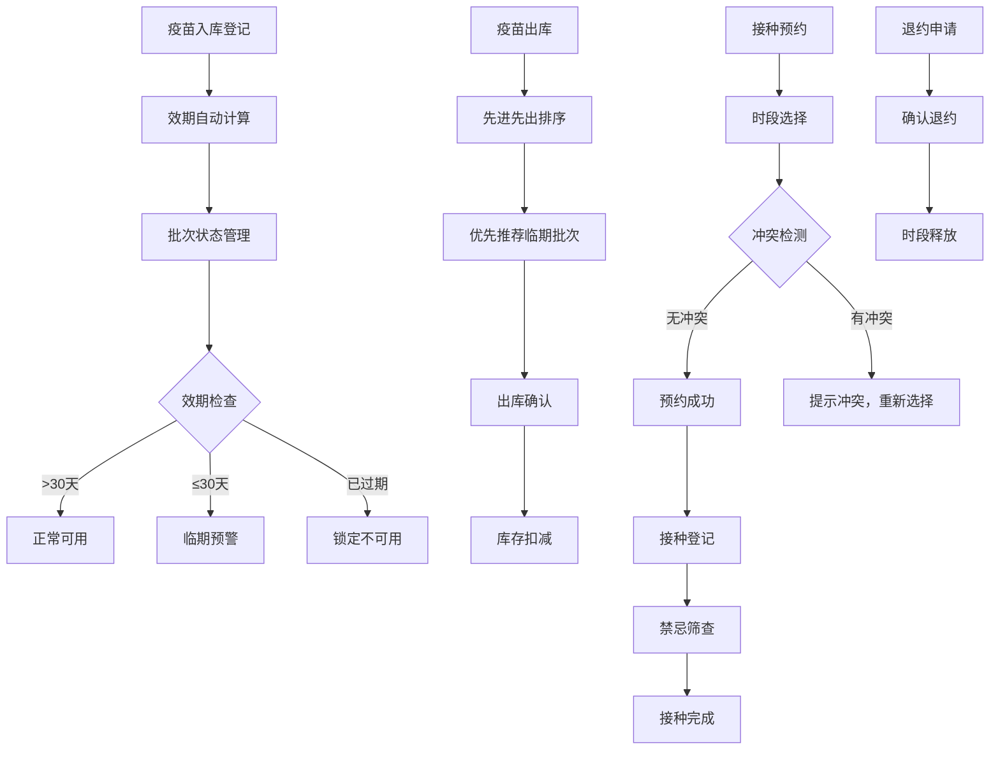

## 1. 产品概述
社区疫苗接种点管理系统，用于管理疫苗批次库存、效期出库、接种排期及冲突校验。解决疫苗过期浪费、接种时段冲突等问题，提升接种点管理效率和服务质量。

## 2. 核心功能

### 2.1 用户角色
| 角色 | 登录方式 | 核心权限 |
|------|----------|----------|
| 管理员 | 账号密码登录 | 疫苗批次管理、效期出库管理、接种排期管理、系统配置 |
| 接种医护 | 账号密码登录 | 疫苗出库操作、接种登记、禁忌筛查、查看排期 |
| 前台登记 | 账号密码登录 | 预约登记、退约处理、时段查询 |

### 2.2 功能模块
1. **疫苗批次管理**：批号效期登记、批次列表、状态管理
2. **效期出库管理**：先进先出出库、临期预警、过期批次锁定
3. **接种排期管理**：接种位管理、时段预约、退约处理
4. **冲突校验中心**：时段重叠校验、退订释放、接种禁忌筛查

### 2.3 页面详情
| 页面名称 | 模块名称 | 功能描述 |
|----------|----------|----------|
| 首页仪表盘 | 数据概览 | 库存统计、临期预警、今日接种量、预约情况 |
| 疫苗批次管理 | 批次登记 | 录入疫苗批号、名称、生产厂家、效期、数量 |
| 疫苗批次管理 | 批次列表 | 分页展示、状态筛选、搜索、过期锁定操作 |
| 效期出库管理 | 出库操作 | 按效期排序自动推荐批次、出库登记、库存扣减 |
| 效期出库管理 | 临期预警 | 30天内过期批次高亮、预警提醒、优先出库标识 |
| 接种排期管理 | 接种位配置 | 接种位增删改、启用停用 |
| 接种排期管理 | 时段预约 | 按日期查看接种位时段、预约登记、冲突检测 |
| 接种排期管理 | 退约处理 | 取消预约、时段释放、状态更新 |
| 冲突校验中心 | 时段校验 | 检测并提示时段重叠情况 |
| 冲突校验中心 | 禁忌筛查 | 输入受种者信息，筛查接种禁忌症 |

## 3. 核心流程

### 3.1 疫苗入库流程
管理员登记疫苗批次信息 → 系统自动计算效期剩余天数 → 批次入库，状态为"正常"

### 3.2 疫苗出库流程
医护人员选择疫苗类型 → 系统按效期先进先出自动排序推荐批次 → 临期/过期批次高亮提示 → 确认出库 → 扣减库存

### 3.3 接种预约流程
前台选择接种日期和接种位 → 查看可用时段 → 选择时段预约 → 系统检测时段冲突 → 无冲突则预约成功 → 时段状态更新为"已预约"

### 3.4 退约流程
查询已预约记录 → 选择退约 → 确认退约 → 时段状态恢复为"可用"

### 3.5 禁忌筛查流程
输入受种者健康信息 → 系统匹配禁忌规则 → 输出筛查结果和建议

## 4. 用户界面设计

### 4.1 设计风格
- **主色调**：医疗蓝 `#165DFF`，代表专业、信任
- **辅助色**：警示橙 `#FF7D00`（临期预警）、危险红 `#F53F3F`（过期/冲突）、成功绿 `#00B42A`（正常可用）
- **中性色**：`#1D2129` 深灰（标题）、`#4E5969` 中灰（正文）、`#C9CDD4` 浅灰（边框）、`#F2F3F5` 背景灰
- **按钮风格**：圆角8px，主按钮蓝色填充，次按钮边框样式
- **字体**：系统字体栈，标题16px粗体，正文14px常规，辅助文字12px
- **布局风格**：卡片式布局，左侧导航+右侧内容区，顶部状态栏
- **图标风格**：使用 Lucide 线性图标，颜色与功能状态对应

### 4.2 页面设计概述
| 页面名称 | 模块名称 | UI元素 |
|----------|----------|--------|
| 首页仪表盘 | 数据概览 | 4个数据卡片（库存总量、临期预警数、今日预约、今日接种），折线图（近7日接种趋势），列表（最近出库记录） |
| 疫苗批次管理 | 批次列表 | 顶部搜索筛选栏，数据表格（批号、疫苗名称、厂家、效期、剩余天数、数量、状态、操作），状态标签颜色区分 |
| 效期出库管理 | 出库操作 | 左侧疫苗选择，中间批次推荐列表（按效期排序，临期高亮），右侧出库表单 |
| 接种排期管理 | 预约日历 | 日期选择器，接种位Tab切换，时段网格（可用/已预约/已锁定状态），预约弹窗表单 |
| 冲突校验中心 | 校验面板 | 左侧时段冲突检测结果列表，右侧禁忌筛查表单和结果展示 |

### 4.3 响应式
- 桌面端优先设计，最小支持1280px宽度
- 平板端适配：侧边栏可折叠，表格支持横向滚动
- 移动端适配：导航底部化，卡片垂直堆叠

### 4.4 交互细节
- 临期批次卡片带脉冲动画提醒
- 时段选择悬停高亮，点击有缩放反馈
- 出库确认、退约等危险操作需二次确认弹窗
- 表单提交有loading状态和成功/失败提示
- 表格支持列宽拖拽调整
