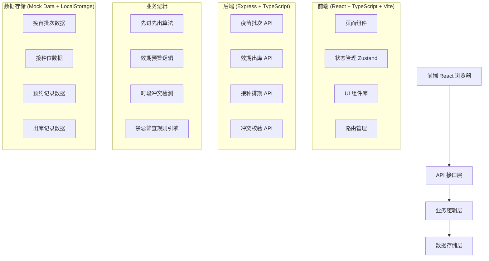

## 1. 架构设计



## 2. 技术描述

- **前端**：React@18 + TypeScript + Vite@5
- **状态管理**：Zustand@4
- **路由**：React Router DOM@6
- **样式**：TailwindCSS@3
- **UI 组件**：shadcn/ui + Lucide React 图标
- **图表**：Recharts
- **后端**：Express@4 + TypeScript
- **初始化工具**：vite-init
- **数据存储**：前端 Mock 数据 + LocalStorage 持久化

## 3. 路由定义

| 路由路径 | 页面组件 | 功能说明 |
|----------|----------|----------|
| / | Dashboard | 首页仪表盘 |
| /vaccine-batches | VaccineBatches | 疫苗批次管理 |
| /outbound | Outbound | 效期出库管理 |
| /schedule | Schedule | 接种排期管理 |
| /validation | Validation | 冲突校验中心 |
| /login | Login | 登录页 |

## 4. API 定义

### 4.1 类型定义

```typescript
// 疫苗批次
interface VaccineBatch {
  id: string;
  batchNo: string;
  vaccineName: string;
  manufacturer: string;
  productionDate: string;
  expiryDate: string;
  quantity: number;
  remainingQuantity: number;
  status: 'normal' | 'warning' | 'expired' | 'locked';
  createdAt: string;
}

// 接种位
interface VaccinationStation {
  id: string;
  name: string;
  status: 'active' | 'inactive';
}

// 时段
interface TimeSlot {
  id: string;
  stationId: string;
  date: string;
  startTime: string;
  endTime: string;
  status: 'available' | 'booked' | 'locked';
  vaccineType?: string;
}

// 预约记录
interface Appointment {
  id: string;
  slotId: string;
  patientName: string;
  patientIdCard: string;
  phone: string;
  vaccineType: string;
  status: 'booked' | 'completed' | 'cancelled';
  createdAt: string;
}

// 出库记录
interface OutboundRecord {
  id: string;
  batchId: string;
  vaccineName: string;
  batchNo: string;
  quantity: number;
  operator: string;
  outboundTime: string;
  patientName?: string;
}

// 禁忌筛查结果
interface ContraindicationResult {
  hasContraindication: boolean;
  warnings: string[];
  suggestions: string[];
}
```

### 4.2 疫苗批次 API

| 方法 | 路径 | 说明 | 请求参数 | 返回 |
|------|------|------|----------|------|
| GET | /api/batches | 获取批次列表 | vaccineName?, status? | VaccineBatch[] |
| POST | /api/batches | 新增批次 | VaccineBatch | VaccineBatch |
| PUT | /api/batches/:id | 更新批次 | VaccineBatch | VaccineBatch |
| DELETE | /api/batches/:id | 删除批次 | - | success |
| PUT | /api/batches/:id/lock | 锁定过期批次 | - | VaccineBatch |

### 4.3 效期出库 API

| 方法 | 路径 | 说明 | 请求参数 | 返回 |
|------|------|------|----------|------|
| GET | /api/outbound/recommend | 获取推荐出库推荐批次 | vaccineName | VaccineBatch[] (按效期排序) |
| POST | /api/outbound | 执行出库 | batchId, quantity, operator, patientName? | OutboundRecord |
| GET | /api/outbound/records | 获取出库记录 | - | OutboundRecord[] |
| GET | /api/outbound/warnings | 获取临期预警列表 | days=30 | VaccineBatch[] |

### 4.4 接种排期 API

| 方法 | 路径 | 说明 | 请求参数 |
|------|------|------|----------|------|
| GET | /api/stations | 获取接种位列表 | - | VaccinationStation[] |
| POST | /api/stations | 新增接种位 | name | VaccinationStation |
| PUT | /api/stations/:id | 更新接种位 | name, status | VaccinationStation |
| DELETE | /api/stations/:id | 删除接种位 | - | success |
| GET | /api/slots | 获取时段列表 | stationId, date | TimeSlot[] |
| POST | /api/appointments | 创建预约 | slotId, patientName, patientIdCard, phone, vaccineType | Appointment |
| DELETE | /api/appointments/:id/cancel | 取消预约 | - | Appointment |
| GET | /api/appointments | 获取预约列表 | date?, stationId? | Appointment[] |

### 4.5 冲突校验 API

| 方法 | 路径 | 说明 | 请求参数 | 返回 |
|------|------|------|----------|------|
| POST | /api/validation/conflict | 检测时段冲突 | stationId, date, startTime, endTime | { hasConflict: boolean, conflicts: TimeSlot[] } |
| POST | /api/validation/contraindication | 禁忌筛查 | healthInfo | ContraindicationResult |

## 5. 数据模型

### 5.1 关系图

```mermaid
erDiagram
    VACCINE_BATCH ||--o{ OUTBOUND_RECORD : "has
    VACCINATION_STATION ||--o{ TIME_SLOT : "has"
    TIME_SLOT ||--o| APPOINTMENT : "has"
```

### 5.2 数据初始化

```typescript
// 初始疫苗批次数据
const initialBatches: VaccineBatch[] = [
  {
    id: '1',
    batchNo: 'CV202401001',
    vaccineName: '新冠疫苗',
    manufacturer: '国药中生',
    productionDate: '2024-01-15',
    expiryDate: '2026-01-14',
    quantity: 500,
    remainingQuantity: 480,
    status: 'normal',
    createdAt: '2024-01-20'
  },
  // 更多mock数据...
];

// 初始接种位数据
const initialStations: VaccinationStation[] = [
  { id: '1', name: '接种位 A', status: 'active' },
  { id: '2', name: '接种位 B', status: 'active' },
  { id: '3', name: '接种位 C', status: 'inactive' },
];

// 禁忌规则
const contraindicationRules = [
  { type: 'fever', condition: (info) => info.temperature > 37.5, message: '体温超过37.5°C，建议暂缓接种' },
  { type: 'allergy', condition: (info) => info.hasVaccineAllergy, message: '有疫苗过敏史，需谨慎评估' },
  { type: 'pregnancy', condition: (info) => info.isPregnant, message: '妊娠期妇女，建议咨询医生后决定' },
  { type: 'acuteIllness', condition: (info) => info.hasAcuteIllness, message: '患有急性疾病，建议暂缓接种' },
];
```

## 6. 核心业务逻辑

### 6.1 先进先出算法
```typescript
function getFIFOBatches(batches: VaccineBatch[], vaccineName: string): VaccineBatch[] {
  return batches
    .filter(b => b.vaccineName === vaccineName && b.status !== 'locked' && b.status !== 'expired' && b.remainingQuantity > 0)
    .sort((a, b) => new Date(a.expiryDate).getTime() - new Date(b.expiryDate).getTime());
}
```

### 6.2 效期状态计算
```typescript
function calculateBatchStatus(expiryDate: string): 'normal' | 'warning' | 'expired' {
  const now = new Date();
  const expiry = new Date(expiryDate);
  const diffDays = Math.ceil((expiry.getTime() - now.getTime()) / (1000 * 60 * 60 * 24));
  
  if (diffDays <= 0) return 'expired';
  if (diffDays <= 30) return 'warning';
  return 'normal';
}
```

### 6.3 时段冲突检测
```typescript
function checkTimeConflict(
  slots: TimeSlot[],
  startTime: string,
  endTime: string
): { hasConflict: boolean; conflicts: TimeSlot[] } {
  const conflicts = slots.filter(slot => {
    if (slot.status !== 'available') {
      const slotStart = slot.startTime;
      const slotEnd = slot.endTime;
      return (startTime < slotEnd && endTime > slotStart);
    }
    return false;
  });
  
  return { hasConflict: conflicts.length > 0, conflicts };
}
```
